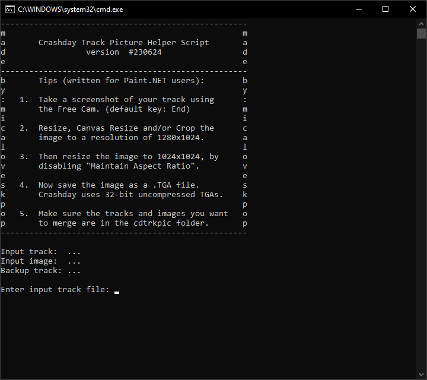

# Crashday Track Picture Helper Script

The Crashday Track Picture Helper Script is tool that aims to simplify the process of integrating custom images into Crashday tracks as in-game track previews, something that orginally was only possible via the command line. This helper script provides tips on how players should prepare their image file, it also presents an easy-to-use menu for users to input their track and image files. In case any issues arise, it also provides the user with informative notices and error messages. As the cherry on top, the script also uses an included Python Interpreter in order to perform file checks, ensuring that all input files are of a compatible format.

## Table of Contents
- [Features](#features)
- [Usage](#usage)
- [Screenshots](#screenshots)
- [Acknowledgements](#acknowledgements)
<!--- - [Licenses](#license) -->

## Features

- Players can run a simple batch script instead of having to learn how to use the command line
- Displays tips on how to adjust your screenshots to be compatible with the tool
- Supports dragging and dropping files
- Automatically adds .trk/.tga extensions to user inputs as necessary
- Automatically backs up tracks before merging screenshots into them
- Included Python Interpreter and Python script, which:
  - Checks if the input track file is in Crashday TRK format
  - Checks if the input image file is in a compatible TGA format
- Might any issues arise, the user is informed of the issue and what actions to take

## Usage

1. Exact both folders into `.../Crashday/Tools` (default location C:/Program Files/Steam/steamapps/common/Crashday/tools/)
2. Run the included `cdtrkpic_mica.bat` file
3. Follow the on-screen instructions
4. After successfully completing the merge, copy/move your track file into `.../Crashday/user/`

## Screenshots

| THE INITIAL VIEW | A SUCCESSFUL MERGE |
| --- | --- |
|  |  |

| CHANGING A SETTING | INPROPER TRK FILE | INPROPER TGA FILE |
| --- | --- | --- |
|  |  |  |

## Acknowledgements

This project makes use of some code and text generated with the help of [Bing Chat](https://www.bing.com/search?q=Bing+AI&showconv=1) and [ChatGPT](https://chat.openai.com/).
<!---
## License

This project is licensed under the GNU GPLv3 License. See the [LICENSE](https://github.com/MicaLovesKPOP/WinterBot/blob/main/LICENSE) file for details.
-->
